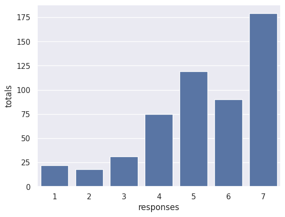
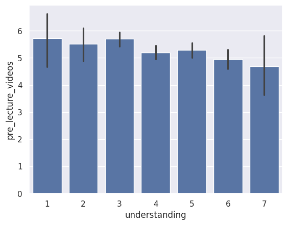
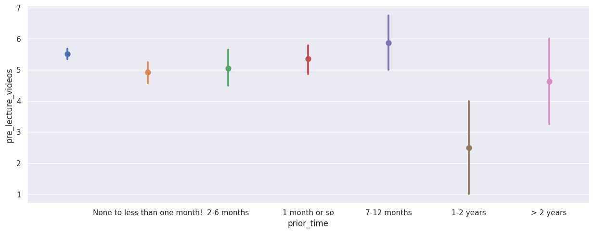

---
# Do not edit the text between these lines!
layout: default
---

# Overview
In this analysis, survey data from COMP 110 students was investigated to determine if adding optional pre-lecture videos would be beneficial to learning in the course. This topic was chosen because many COMP 110 students have little to no programming experience, so having a chance to be introduced to topics before lecture could be beneficial. Survey data was analyzed through three plots: two bar charts and one point plot. 

<!-- This is a comment. Below, you'll see code for inserting an image. To make this image appear, update <custom-path>. To add an image, save it inside the imgs folder of this repository. -->
# Images

## Plot 1

## Plot 2

## Plot 3

# Conclusion
This analysis investigated whether current COMP 110 students would benefit from pre-lecture videos as an introduction to the topic before class, since many students have little to no programming experience. The analysis supports the prediction that adding pre-lecture videos would provide an additional opportunity for understanding and becoming familiar with new topics before class and especially benefit students who are programming for the first time. Plot 1 is a barplot that shows that the number of COMP 110 students who answered a given ranking (1-7) of whether they would benefit from pre-lecture materials generally increased as the ranking increased, or got closer to strongly agree. The highest count of students answered 7, which means most COMP 110 students strongly agree that optional pre-lecture videos would benefit their learning. Plot 2 was a bar plot that compared perceived understanding of course concepts and ranking of the expected benefit of pre-lecture videos. This plot shows that the average ranking of whether people would benefit from pre-lecture videos on a scale of 1-7 increases as perceived understanding of the course content decreases, meaning people who believe they do not understand the content agree more with the idea that pre-lecture videos would be beneficial to learning. People who already have a strong understanding of the course may have already been familiar with concepts and not need the extra introduction like first-time programming students would. Plot 3 was a point plot that directly compared the average response of how much pre-lecture videos would be beneficial with programming experience. This plot was not as conclusive as the first two, but it did show a very low average response of whether people would benefit from pre-lecture videos for those with 1-2 years of programming experience compared with all other groups. This suggests that while this group of COMP 110 students may not benefit from this addition, many other groups, especially those with less experience, would. 

While the data imply that students believe they would benefit from pre-lecture materials, there are some potential downsides. First, students might find that the materials are sufficient for understanding the topics covered in class, and as a result choose to skip class, lowering overall attendance. A decrease in class attendance could lead to lower mean quiz scores and potentially lower grades in the class. There is also a chance that students who said they would benefit from pre-class materials actually wouldn’t end up using them because they are supplemental and ungraded, meaning that teachers and TAs who spend time assembling the resources would be wasting their time. Because of these factors, it would be important for materials provided to be short and only give an overview of the concepts so that students would not choose to miss class or skip reviewing them completely. 

One possible extension to this idea could be providing students with post-lecture supplemental materials. These materials could be based on class content, so students would have to have a basic understanding of what they learned in class to benefit from them. They could summarize the content and include some further ungraded practice. This could set students up for success on the programming exercises (EX) and lesson responses (LS). These materials could also be used by students when they are studying for quizzes or the final exam. Some possible extension to the analysis conducted could be giving students these pre-lecture videos for a semester and surveying them at the end on how useful they were, or asking students how useful optional pre-lecture readings instead of videos and testing this idea. 
